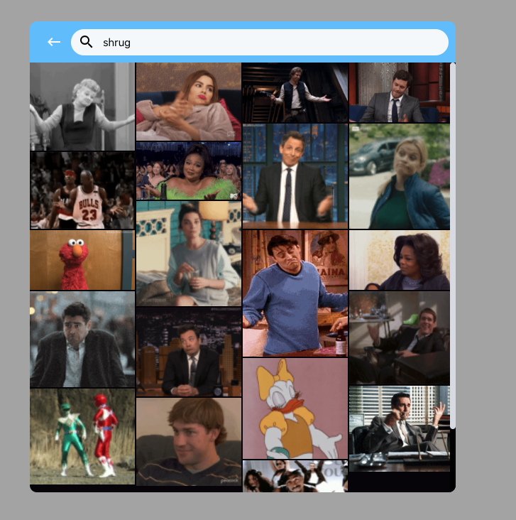

# React twitter Gifpicker

Responsive Gifpicker for your React app




# Prerequisite

Request a free api key @ https://support.giphy.com/hc/en-us/articles/360020283431-Request-A-GIPHY-API-Key


# Installation

`npm i react-twitter-gifpicker --save`

```
import { useState } from 'react';
import GifPicker from 'react-twitter-gifpicker';

function App() {
  const [open, setOpen] = useState(false);
  const onPickGif = (gif, e) => {
    console.log(gif)
  }

  return (
    <div>
      <button onClick={() => setOpen(true)}>click</button>
      <GifPicker
        api_key={'your api key'}
        borderRadius={10}
        columns={4}
        open={open}
        onClose={() => setOpen(false)}
        onGifClick={onPickGif}
        onPickClose={false}
      />
    </div>
  );
}

```

# User Guide

Props
| Prop Name   | Description | Type |Default Value | Example |
| ----------- | ----------- |------|--------------|---------|
| api_key | The api key for using giphy api | String | none | api_key={'your api key'} |
| width    | The width for the gifpicker container| number | 600 | width={500} |
| height   | The height for the gifpicker container| number | 70vh | height={400} |
|topBarColor| The color for the top bar of gifpicker | String | ocean blue | topBarColor={'#000'} |
| borderRadius | The border Radius for the gifpicker container | number | 15 | borderRadius={10} |
| columns | The number of columns in the gifpicker grid | number | 4 | columns={3} |
| open | Determine if the gifpicker should be opened | Boolean | false | opne={true} |
| onPickClose | Close the gifpicker when a gif is cliked | Boolean | false | onPickClose={true} |
| onClose | The function to call when the gifpick is about to close | Func | none | onClose={() => setClose(true)} |
| onGifClick | The function to call when a gif is clicked. It takes two arguments: (gif: Object, e: event) | Func | none| const onPickGif = (gif, e) => { console.log(gif) } |

__Note:__ onClose() relies on the external setClose() to close the gifpicker.


```
Gif Object = {
  ...,
  images: {
    480w_still: {height, width, size, url},
    downsized: {height, width, size, url},
    downsized_large: {height, width, size, url},
    downsized_medium: {height, width, size, url},
    downsized_small: {height, width, size, url},
    downsized_still: {height, width, size, url},
    ...,
    original_mp4: {height, width, mp4_size, mp4},
    preview: {height, width, mp4_size, mp4},
    preview_gif: {height, width, size, url}
  },
  ...
}
```
